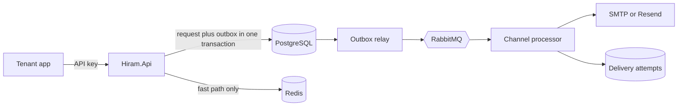

<p align="center">
  
</p>

<h1 align="center">H I R A M &#8756;</h1>

<p align="center"><em>The word is never lost.</em></p>

<p align="center">
  Internal multi-tenant notification gateway for .NET products and selected clients.<br>
  Durable submission, provider-independent email delivery, retries, audit and replay.
</p>

<p align="center">
  <a href="https://github.com/michel-az-de/hiram/actions/workflows/ci.yml"></a>
  <a href="LICENSE"></a>
  
</p>

---

## What this is

Hiram accepts a notification, persists it with an outbox row in the same PostgreSQL transaction,
and takes responsibility from there. It authenticates tenants, honors idempotency keys, resolves an
email provider, retries transient failures, records every attempt and exposes dead-letter replay.

Hiram is internal infrastructure, not a general-purpose notification SaaS. Email is the required
channel. Templates, raw events, routines and Web Push are compatibility extensions that remain only
while an active project uses them.

## Current status

The existing runtime is implemented and covered by CI, but still uses:

- Hiram.Api;
- Hiram.Dispatcher;
- PostgreSQL;
- RabbitMQ;
- Redis.

[ADR-027](docs/adr/ADR-027-hiram-core.md) approved a smaller target: one Hiram host and PostgreSQL,
with providers external to the runtime. The incremental migration is specified in
[plans/hiram-core.md](plans/hiram-core.md). Until those steps merge, the quick start below describes
the current runtime rather than the target.

## Current architecture



PostgreSQL is already the durable authority for the notification, outbox and idempotency. Redis is
a fast path. RabbitMQ currently transports outbox items to channel processors and will be replaced
by a leased PostgreSQL queue during the Hiram Core migration.

## Core guarantees

- tenant isolation;
- hashed, revocable API keys;
- `Idempotency-Key` scoped by tenant;
- notification and outbox persisted atomically;
- provider-independent email delivery;
- structured retries and delivery attempts;
- dead-letter and replay;
- channel blocks and consent enforcement in the event-routing path;
- signed status webhooks;
- OpenTelemetry instrumentation.

No system can guarantee exactly one provider call across every crash boundary. Hiram treats the
post-provider uncertainty explicitly through durable claims, provider callbacks and fail-safe
recovery rather than silently resending.

## Quick start

The current development infrastructure requires Docker:

```bash
docker compose -f docker-compose.dev.yml up -d
```

Set the provisional admin key:

```bash
dotnet user-secrets set "Hiram:AdminKey" "admin-dev-local" --project src/Hiram.Api
```

Start the current hosts in separate terminals:

```bash
dotnet run --project src/Hiram.Api
dotnet run --project src/Hiram.Dispatcher
```

Create a tenant and API key:

```bash
curl -s -X POST http://localhost:3357/v1/admin/tenants \
  -H "X-Admin-Key: admin-dev-local" \
  -H "Content-Type: application/json" \
  -d '{"name":"example","deliveryMode":"live"}'

curl -s -X POST http://localhost:3357/v1/admin/api-keys \
  -H "X-Admin-Key: admin-dev-local" \
  -H "Content-Type: application/json" \
  -d '{"tenantId":"<tenant-id>","name":"example-server"}'
```

Send and query a notification:

```bash
curl -i -X POST http://localhost:3357/v1/notifications \
  -H "X-Api-Key: hk_live_..." \
  -H "Idempotency-Key: evt-0001" \
  -H "Content-Type: application/json" \
  -d '{"channel":"email","recipient":"ops@example.com","subject":"hello","body":"from hiram"}'

curl -s http://localhost:3357/v1/notifications/<notification-id> \
  -H "X-Api-Key: hk_live_..."
```

Development tools:

- Scalar: `http://localhost:3357/scalar`
- Mailpit: `http://localhost:8025`
- Aspire Dashboard: `http://localhost:18888`
- RabbitMQ management during migration: `http://localhost:15672`

## Verification

```bash
dotnet build Hiram.sln --configuration Release
dotnet test Hiram.sln --configuration Release
```

Integration tests use Testcontainers and require Docker. CI runs the complete suite.

## Documentation

| Document | Purpose |
|---|---|
| [MASTER-PLAN.md](MASTER-PLAN.md) | Hiram Core charter and success criteria |
| [plans/hiram-core.md](plans/hiram-core.md) | Executable migration |
| [docs/adr/ADR-027-hiram-core.md](docs/adr/ADR-027-hiram-core.md) | Architecture decision |
| [docs/adr/](docs/adr/) | Decision history |

## License

MIT. See [LICENSE](LICENSE).
